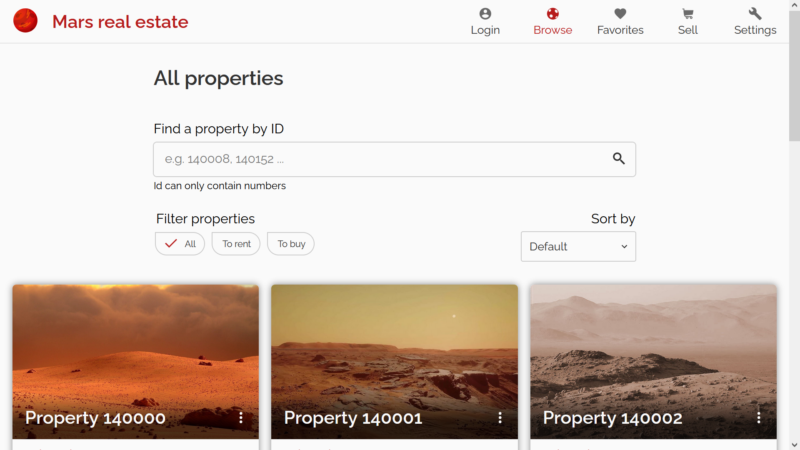
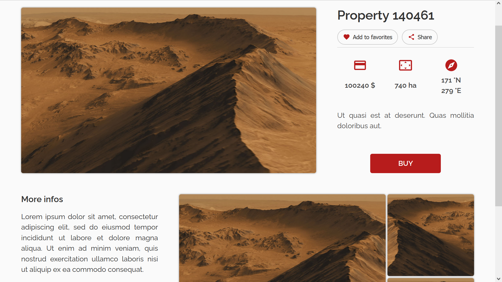
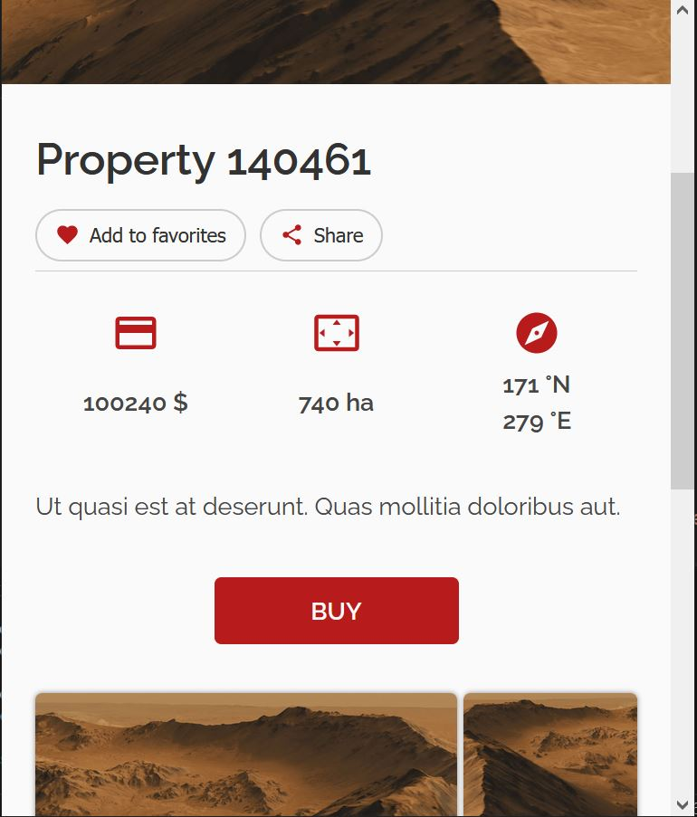
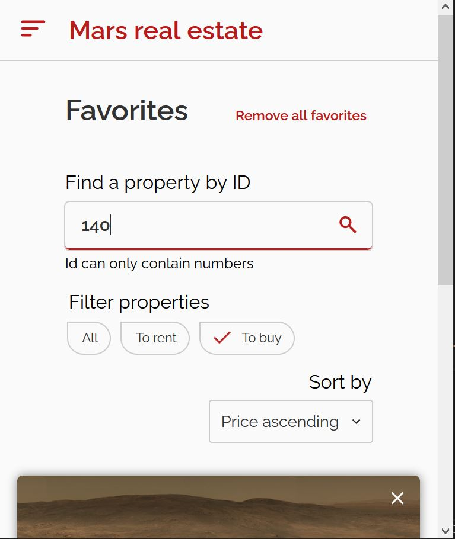
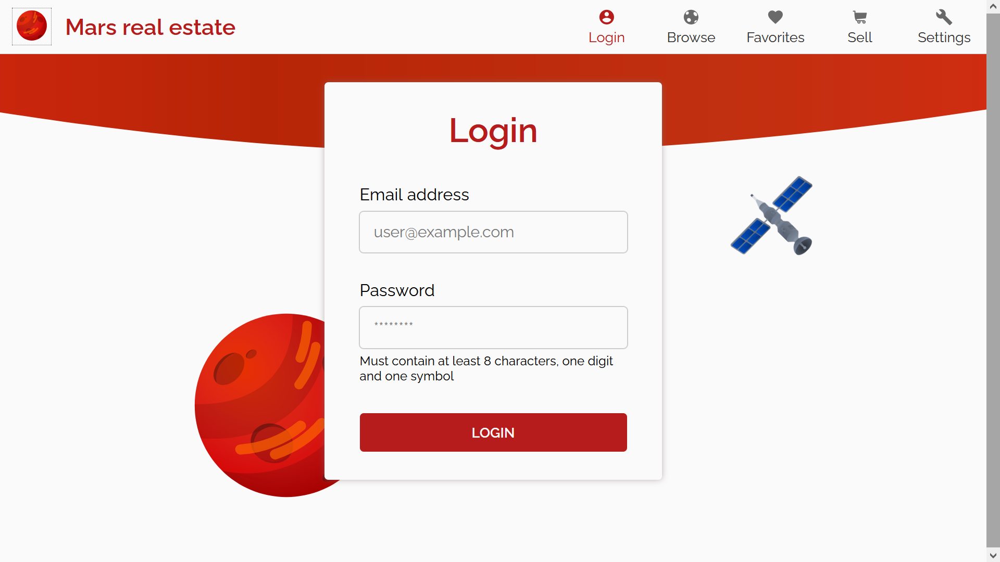
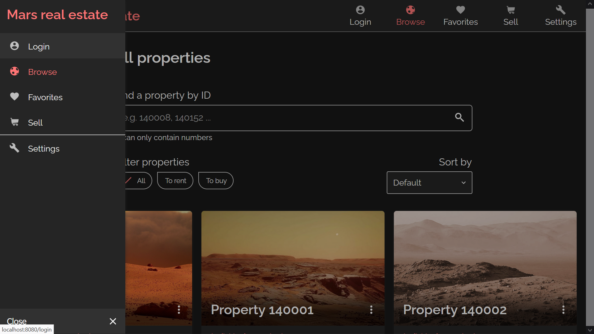

# Mars real estate Vue

### A progressive web app made with [Vue3](https://vuejs.org/) that lets you browse properties on Mars 🪐

Obviously you can't *really* buy properties on mars with this app


All of the properties are stored in memory, they are **not** hosted on a remote server. Only favorites and preferences are saved in the localStorage.


## Features

* Responsive for phone, tablet an desktop (CSS grid is **very** useful for this) 📱💻🖥
* Ability to install the app locally (Progressive Web App)
* Browse properties, filter and sort them
* Mark property as favorite to find them easily (this is saved in localStorage)
* Delete favorites
* Share a property with a link on supported browsers
* Login/Logout 
* Night mode 🌙
* Option to choose a larger font size for the app
* Preferences stored in localStorage


## Architecture

This app was made with:

* Vue 3
* Typescript
* SCSS
* The Options API of Vue
* Vue router
* Vue store
* Babel


## Project setup
```
npm install
```

### Compiles and hot-reloads for development
```
npm run serve
```

### Compiles and minifies for production
```
npm run build
```

## Screenshots








